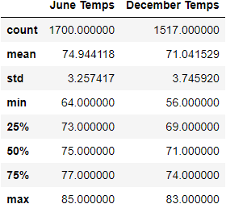
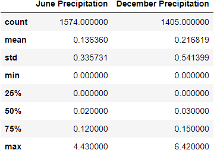

# Surf and Shake

## Overview
An examination of Oahu temperature data over several years in the months of June and December to determine if the *Surf n' Shake* surfing and ice cream shop is viable.

## Resources
- Software:
  - Python 3.10.4
    - numpy
    - Pandas
    - sqlalchemy
      - create_engine
      - ext.automap.automap_base
      - func
      - orm.Session
  - Jupyter 4.8.1
    - Notebook 6.4.5
  - SQLite
- Original Data Sources:
  - hawaii.sqlite

## Results

### Temperature Analysis

We first gathered data from the weather polling stations on Oahu and aggregated the results from June and from December. The results are as follows:

There is little doubt that both surfing and ice cream will be popular enough in June; so the question is whether the business can be maintained year-round. Thus, we should focus our attention on how December's statistics compare with respect to June's. With that in mind, we see the following differences:
- The mean temperature is about 4°F lower—71.0°F vs. 74.9°F.
- The standard deviation is slightly larger—3.75°F vs. 3.26°F—meaning that December's temperatures will vary slightly more than June's.
- The minimum temperature is about 8°F lower than in June—56°F vs. 64°F.
- The 1st quartile (25th percentile) is 4°F lower—69°F vs. 73°F.

### Temperature Conclusions

We see from the temperature statistics that, even in December, the temperature remains mostly comfortable. Of these statistics, the minimum temperature is the most troubling, as, on the coldest days, people will be less likely to surf or to want ice cream; however, we can take solace in the 1st quartile being 69°F, meaning that—even in December—three out of four days are at or above that temperature, which most patrons should find perfectly comfortable. (Additionally, the minimum temperature is most likely to have occurred at night, when the business would be closed, anyway.)

### Precipitation Analysis

Given W. Avy's previous experience with how rain could affect a business, we also wanted to examine Oahu's precipitation in June and December. So aggregated similar statistics for precipitation data, seen here:

Once again, we stipulate that June's numbers are adequate, and we look to see how December's numbers differ from June's:
- The mean precipitation is about 0.28″ higher—0.22″ vs. 0.13″.
- The precipitation standard deviation is also larger—0.54″ vs. 0.34″—meaning that December's rainfall will vary somewhat more than June's.
- The maximum precipitation is about 1″ higher than in June—6.42″ vs. 4.43″.
- The 3rd quartile (75th percentile) of precipitation is 0.03″ higher—0.15″ vs. 0.12″.

### Percipitation Conclusions

The precipitation statistics do show that December is wetter than June (no surprise), and the difference in maximum precipitation may seem troubling, but, once again, we can look to the quartiles to see that, 75% of the time (as per the 1st quartile / 75th percentile), the increased rainfall over June is actually very slight.

## Summary

Per the analysis, above, there is little difference between the weather on Oahu in June and December, either in terms of temperature or precipitation. A typical winter day on the island is much like a Spring or Autumn one in most of the rest of the U.S.

In short, Oahu's weather should not act as a significant barrier to the success of *Surf n' Shake*.